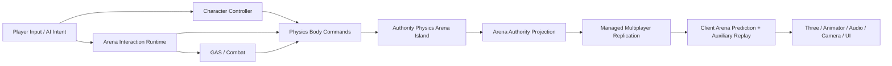

# Knockout Arena 完整物理竞技游戏

Status: Active.

## 工作流目标

把已经验证多人 Physics prediction/rollback 的 `multiplayer-physics-arena-demo` 推进为一个可以完整游玩和验收的物理
竞技游戏：一场比赛包含多 stage 晋级、明确胜负、可靠的角色控制、可拾取/使用/投掷道具、多种场景机关、具备策略的
authority AI，以及完整表现、诊断和网络故障验收。

长期设计入口：

- `docs/apps/multiplayer-physics-arena-demo.md`
- `docs/modules/physics.md`
- `docs/modules/multiplayer.md`
- `docs/modules/combat.md`
- `docs/modules/ai.md`
- `docs/modules/navigation.md`
- `docs/adr/0049-standard-multiplayer-physics-arena-prediction.md`

已关闭的 prediction 基础工作流见 `multiplayer-physics-arena-prediction.md`。本文只记录新的完整游戏实施，不重新实现已
关闭的 snapshot、ack、history、reconcile、hard correction 或 effect journal。

## 完成定义

最终验收必须同时满足：

- 2 个真实浏览器玩家与 6 个 authority bots 能完成资格赛、道具乱斗和坍塌决赛，产生唯一 winner 并 rematch。
- 一名参与者在当前 stage 被淘汰后从 Physics island 移除，只能观战；后续 stage 只恢复已晋级者，下一场 match 才恢复
  完整参赛阵容。
- 玩家可以稳定移动、转向、跳跃、dive、推挤、拾取、近战、蓄力投掷和丢弃；键鼠与标准 gamepad 都可操作。
- 至少 3 个 stage 场景、10 类场景机关/表面、4 类可拾取道具和 3 种 bot archetype 进入真实对局。
- 玩家、动态道具、飞行道具和会产生接触因果的机关使用同一个标准 arena prediction path；游戏不自建 netcode 状态机。
- 0–150 ms one-way latency、0–50 ms jitter、0–5% input loss、snapshot gap 和 duplicate preset 下仍能完成整场比赛，
  不重复命中、胜负、道具消费或 cue。
- 10 分钟 authority/bot soak、双浏览器 smoke、全仓门禁和新增性能预算全部通过。

## 当前能力审计

| 领域         | 已有能力                                                                      | 主要缺口                                                                    | 归属                                                         |
| ------------ | ----------------------------------------------------------------------------- | --------------------------------------------------------------------------- | ------------------------------------------------------------ |
| Multiplayer  | Room authority、冗余输入、完整 arena frame、prediction domain、effect journal | 多 stage 参与者状态、道具离散 command/fact、附加模拟状态同 tick replay      | 规则在 app；标准 replay 扩展在 App Host/Multiplayer 组合     |
| Physics      | Rapier3D、query/contact、full-scene checkpoint、island spawn/patch/despawn    | 一等公民 impulse/body command、角色 motor、held item 的安全物理生命周期     | Physics command 进 Core/adapter；motor 进可选 toolkit        |
| Character    | 共享无状态速度 patch、dynamic capsule、jump                                   | grounded/slope/step/coyote/buffer/platform/dive/stagger/carry 与 checkpoint | 新可复用 character-controller toolkit                        |
| Combat/GAS   | melee/area/projectile、hit dedupe、effect、execution phase、trace             | 物理冲击到 instability/stagger/knockback 的 Arena policy                    | Core 继续复用；数值与结果 policy 留 app                      |
| Item         | dynamic prop、predicted spawn/despawn primitives                              | pickup arbitration、carry/use/throw state、respawn、presentation attachment | Arena app-local runtime + DataType                           |
| AI           | perception、utility、task、intent、scheduler、trace                           | Arena sensor/goal/task、Recast course、hazard timing、item tactics          | AI/Nav Core + Arena definitions/executors                    |
| Match        | countdown/running/results/rematch、淘汰 despawn                               | 多 stage 晋级、观战、timeout tie-break、KO credit、late join                | Arena authority/TCA app-local                                |
| Content      | versioned static layout、少量 kinematic/dynamic body                          | stage/course/hazard/item spawn 数据与 validator                             | Arena DataPack/DataType；backend geometry 留 adapter/tooling |
| Presentation | Three scene、第三人称镜头、HUD、基础 FX                                       | controller state、carry/action/reaction 动画、空间音频、spectator/results   | Animator/Audio/Camera + app presentation mapping             |

## 架构与状态所有权



长期所有权约束：

- Physics solver、body/collider、contact、impulse 和 checkpoint 只由 Physics island 拥有。
- Character controller 持有 grounded/coyote/jump-buffer/dive/recovery 等少量确定性状态，并以独立 rollback contributor
  和 Physics checkpoint 同 tick capture/restore；不能塞进 renderer、AI blackboard 或 body `userData`。
- Match stage、qualified/eliminated、winner、KO credit、item owner 和 item lifecycle 是 authority-only gameplay fact。
- Carried item 不保留一个隐藏的可碰撞 body：world item 被 pickup 后从 island despawn，表现 attachment 使用同一稳定
  item identity；release/throw 使用新 generation 重新 spawn。
- Combat/GAS 决定攻击是否合法、instability/stagger 如何变化；Physics 只执行已提交的空间 command。
- AI 只输出与玩家同构的 intent。Navigation 不移动 body，Animator/Audio/Camera/UI 不写回 gameplay 或 solver state。

## 必须先关闭的公共协议缺口

### Physics body command / impulse

新增 ADR 后，为 Physics facade 提供 backend-neutral、可排序、可 checkpoint/replay 的一次性 body command，至少覆盖：

- linear impulse 与可选 world-space application point；
- angular impulse；
- wake/sleep policy；
- kinematic target 或明确说明继续使用 patch；
- stable tick/sequence/correlation 与 command rejection diagnostics。

Rapier2D/3D 与 memory backend 必须通过同一 conformance。Prediction island 需要能按稳定顺序 replay impulse，不能由 Arena
通过读取 native mass/handle 自己计算或直接调用 Rapier。

### 可复用角色控制器

优先新增独立的可选 `@gamekit/character-controller` toolkit，而不是继续膨胀 Physics Core。它只依赖 GameKit 的
Physics query/body command、World/GameRuntime/Data 协议，不依赖 DOM/Input adapter、Renderer、Three 或 Rapier。

公共 contract 至少包含：

- `CharacterControlIntent`：move、facing/aim、jump、dive 等只影响角色 motor 的物理无关输入；拾取/use/throw 由 app 的
  `ArenaActionIntent` 组合，不能反向膨胀 controller toolkit；
- `CharacterMotorDefinition`：速度、加速度、制动、空中控制、ground probe、坡度、台阶、coyote、buffer、jump/dive；
- `CharacterMotorState`：grounded、ground normal/body、platform velocity、locomotion mode、timers 和 facing；
- pure tick / runtime、checkpoint/reset、trace、diagnostics、memory fixture 和 Rapier3D conformance；
- player 与 AI 共享的 intent sink，不给 AI 特权。

Arena 是第一个真实消费者；Physics 3D Lab 提供第二 fixture。若不同 backend 无法共享同一动态 motor 语义，协议允许窄
backend strategy adapter，但 native controller 类型不能进入公共状态。

### Arena auxiliary replay state

增强标准 Physics Arena adapter，使 Physics island 与 character motor 等少量确定性 contributor 在同一 authority tick
capture/restore/replay/reset。实现必须：

- 保持 Physics solver 只有一个 rollback owner；
- contributor 明确 max bytes/history/replay work；
- generation、membership revision、history overflow 与 dispose 同步处理；
- 不把整个 World、AI、match state 或 presentation state默认回滚；
- 保持只使用无状态 `mapInput` 的现有 consumer 完全兼容。

该变化需要 ADR 和 App Host/Multiplayer/Physics 回归矩阵，不能在 Arena session callback 中私自调用多个 restore loop。

## 游戏内容基线

### Stage 1：Circuit Forge 资格赛

- 8 人起跑，前 6 名晋级。
- 机关：传送带、旋转杆、活塞门、移动平台、弹射板、冰面。
- 道具较少，以验证角色控制、路线选择、动态拥堵和进度排名为主。

### Stage 2：Scrap Yard 道具乱斗

- 6 人进入，前 3 名晋级；场地随时间开启危险区。
- 机关：粉碎机、风区、伸缩墙、滚动物体、中心积分区。
- 四类首发道具全部出现，重点验证 pickup 冲突、carry、近战、throw、impact 与 KO credit。

### Stage 3：Crown Collapse 决赛

- 3 人进入，最后存活者获胜。
- 机关：坍塌地板、收缩安全区、旋转 sweeper、间歇弹射和少量高价值道具。
- 必须在有限时间内强制收敛；timeout 只作为故障保护。

### 首发道具

| 道具   | 生命周期与使用                                | 主要验证                                     |
| ------ | --------------------------------------------- | -------------------------------------------- |
| 泡沫球 | 快速拾取、短蓄力、快速投掷、命中后弹跳/耗尽   | predicted throw、bounce、轻 knockback        |
| 能量块 | 慢速携带、长蓄力、重投、落地后可再次拾取      | carry 降速、重 impulse、动态 body            |
| 冲击球 | 投掷后延时或首次碰撞触发 area impulse         | authority fuse、范围命中去重、speculative FX |
| 泡沫锤 | carried melee windup → arc delivery，也可丢弃 | GAS phase、Combat melee、stagger、朝向       |

Item DataType 至少声明 mass/impulse profile、carry modifier、windup、cooldown、respawn、delivery/effect reference、
presentation binding 和 network strategy。数值不能散落在 input/session/render 文件。

## AI 基线

### Sensor

- opponents：距离、相对速度、instability、是否携带道具、是否在危险边缘；
- items：可见/可达、类型、距离、争抢者数量；
- hazards：kill volume、收缩区、移动机关 phase、落脚面和逃生方向；
- objectives：finish/checkpoint、中心区、晋级名额与剩余时间；
- recent impact：攻击来源、最后有效推力和短期威胁。

### Goal 与 task

- `survive`：远离边缘/危险区，优先安全落点；
- `advance`：沿 Navigation route 推进资格赛；
- `acquire-item` / `deny-item`：评估距离、价值和竞争风险；
- `attack-vulnerable`：选择高 instability、靠近边缘或正在 recovery 的目标；
- `contest-objective`：争夺中心区或最后晋级位置；
- `recover-position`：stuck、被击飞或路线失效后的受控恢复。

Task 只输出 move/aim/jump/dive/interact/use/throw intent。Bot archetype 使用 data 权重：`sprinter`、`brawler`、
`opportunist`；skill profile 调整 perception delay、aim error、commitment、risk 和 reaction time。

## 实施阶段

| 阶段                             | 状态    | 主要产物                                                                          | 独立验收门                                         |
| -------------------------------- | ------- | --------------------------------------------------------------------------------- | -------------------------------------------------- |
| P0：决策与基准                   | Planned | Physics command、character controller、auxiliary replay ADR；数据/预算基线        | 公共边界 review；现有 consumer 兼容                |
| P1：Physics command 与角色控制器 | Planned | Core/adapter command、character toolkit、键鼠/gamepad、player/AI shared intent    | Rapier3D controller course；prediction replay 一致 |
| P2：赛事 authority               | Planned | 多 stage 状态机、participant/qualification/spectator、winner/tie-break、TCA facts | headless 8 人完整 match/rematch                    |
| P3：道具与物理战斗               | Planned | Item runtime/DataType、pickup/carry/use/throw、Combat/GAS、KO credit              | 2 client 争抢同一道具；无重复消费/命中             |
| P4：场景与内容                   | Planned | 3 stage、机关/表面、shared layout、Recast source/validator                        | 每场可完成；无不可达 spawn/goal                    |
| P5：AI                           | Planned | Arena sensors/goals/tasks/archetypes、Navigation/steering、AI trace               | bots 能晋级、拾取、攻击、避险且不作弊              |
| P6：表现与 UX                    | Planned | Animator、Audio、camera、HUD、spectator、results、可读 telegraph                  | 双窗口完整比赛体验，无 debug-only UI               |
| P7：网络与性能加固               | Planned | item/pickup fault matrix、arena gameplay benchmark、soak、budget diagnostics      | 150 ms/5% loss 下整场收敛                          |
| P8：最终验收与关闭               | Planned | review、全仓门禁、浏览器验收、文档收口、提交记录                                  | 完成定义全部满足                                   |

## 分阶段实施细节

### P0：决策与基准

1. 为上述三个公共缺口分别完成影响分析和 ADR；公共 API 未通过 review 前不写 Arena 私有替身。
2. 记录当前 14-member Arena 的 authority step、snapshot bytes、checkpoint/history 和 replay p50/p95/max。
3. 建立目标 profile：8 actor、16 dynamic/item、12 kinematic/hazard，作为 36-member 正确性与性能基线。
4. 定义 Arena app-local DataType：match rule、stage、course、hazard、item、motor profile、bot archetype、spawn set。
5. 明确稳定 identity/generation：participant、actor、item、pickup claim、attack execution、hit ticket、KO credit。

### P1：Physics command 与角色控制器

1. 先实现 memory backend/conformance，再接 Rapier2D/3D body command；任何 native capability 差异进入 diagnostics。
2. 角色控制器按 ground sensing → intent shaping → motor state → body command 顺序 tick；不读取 Renderer/camera native state。
3. camera-relative 输入由 app 把相机 yaw 转成 intent；controller 只消费归一化 world/local desired direction。
4. motor checkpoint 与 Physics island 同 tick replay，测试 coyote、jump buffer、platform、dive、stagger 中途 reconcile。
5. 用专门 controller course 验收平地、坡、台阶、移动平台、边缘、推挤、落地和高延迟输入。

### P2：赛事 authority

1. 拆出 app-local match director、stage rule、ranking projector 和 participant registry，禁止继续扩大单个 authority 文件。
2. 参与者状态显式区分 active、qualified、eliminated、spectator、next-match、disconnected。
3. 每个 stage 使用新 generation；晋级/淘汰改变 membership revision，并安装完整 baseline。
4. KO credit 使用最近有效 authority impact 的有界窗口；环境淘汰、disconnect、timeout 和平局都有稳定 reason/tie-break。
5. Snapshot 复制公开排名和结果事实，不复制 director 内部候选/计时缓存。

### P3：道具与物理战斗

1. Item runtime 拆分 definition compiler、authority state machine、interaction targeter、Physics lifecycle、Combat bridge、projection。
2. Interaction 用 overlap/shape cast + stable sorting 选择候选；pickup claim 按 tick/sequence/participant id 稳定裁决。
3. Carried item 从 island despawn；throw/drop 使用 stable item generation spawn，并匹配 owner predicted spawn。
4. GAS execution 管理 windup/commit/recover/cooldown，Combat 管理 melee/area/projectile hit 与 effect 去重。
5. Arena impact policy 把 contact/Combat 空间事实映射为 instability、stagger 和 Physics impulse；淘汰仍只在 authority。
6. effect journal 覆盖 pickup、windup、throw、impact、stagger、KO 的 anticipate/confirm/cancel/replace。

### P4：场景与内容

1. Course definition 同时生成 authority/client Physics layout、Navigation source、presentation placement 和内容校验 probe。
2. 静态 geometry 不进入每帧 payload；kinematic schedule 由 stage seed + tick 确定性计算。
3. 所有动态/kinematic 接触成员进入 island；装饰只进 Renderer，不能形成隐形 blocker。
4. Joint-like 机关使用可验证的 kinematic 设计；需要真实 constraint 的内容推迟到 Physics constraint ADR 后。
5. Validator 检查 spawn clearance、required route、kill volume、item overlap、hazard phase 和 stage 强制收敛。

### P5：AI

1. AI Core 只安装在 authority；为 Arena 注册 sensor/input/task executor 和 DataPack，不复制一套 bot runtime。
2. 资格赛使用 Recast/static route + portal traversal；动态机关与其他玩家通过 local steering/hazard timing 修正 intent。
3. Perception/decision/path request 按 stable bucket 错峰，Physics/character controller 保持 60 Hz。
4. 对目标 churn、道具争抢、边缘攻击、stuck、item unavailable、path stale 和 stage change 做 deterministic fixture。
5. DevTools 可查看 goal score、task phase、目标、route、失败原因和 budget delay，但不复制完整 AI blackboard 给客户端。

### P6：表现与 UX

1. Animator graph 覆盖 idle/run/jump/fall/dive/carry/windup/throw/melee/stagger/eliminated；gameplay timing 不等动画 marker。
2. Audio event 覆盖脚步材质、机关、pickup、windup、impact、crowd、qualification/KO/result，并限制并发/优先级。
3. Camera 处理速度 look-ahead、碰撞、item aim、dive/impact shake、淘汰后 spectator target，display state 不写回 simulation。
4. HUD 展示 stage objective、晋级线、携带道具、instability、存活数、KO feed、spectator 和最终领奖台。
5. 远端/late join 根据 authority phase 恢复动作和音频状态，不从头重播过期 one-shot。

### P7：网络与性能加固

1. 扩展 fault matrix：pickup 冲突、held owner change、predicted throw、bounce/area impact、stage revision、late join、reconnect。
2. 新增 `bench:arena-gameplay:check`，覆盖 character、items、Combat/GAS、AI、Navigation、projection 和 replay 的真实组合。
3. Profile snapshot payload、checkpoint bytes、history、command count、hard correction、GC/heap 和 authority/client tick。
4. 先优化定义编译、临时分配、query batching、trace retention 和内容上限；不能通过移除仍可碰撞成员伪造性能通过。
5. 10 分钟 soak 包含 stage churn、item spawn/despawn、bot 决策、network fault 和 rematch，dispose 后 retained state 为 0。

## 验收预算

首轮目标预算；P0 用真实基线校准，但任何放宽都必须记录测量证据：

| 指标                 | 目标                                                                                |
| -------------------- | ----------------------------------------------------------------------------------- |
| Authority fixed step | 8 actor / 36 island member 下 p95 ≤ 4 ms，max ≤ 8 ms                                |
| Client replay        | 12-tick replay p95 ≤ 5 ms；30-tick replay p95 ≤ 12 ms                               |
| Snapshot payload     | 20 Hz、36 member + gameplay facts p95 ≤ 32 KiB，hard max 64 KiB                     |
| Checkpoint/history   | 单 checkpoint ≤ 512 KiB；总 history ≤ 96 MiB                                        |
| Input/prediction     | lead/replay command/hard correction 全部有界；正常网络无持续 hard correction        |
| AI                   | 8 bot perception/decision/path 不超过 authority step 预算的 20%；无同帧全量重评尖峰 |
| Browser              | 1080p 目标 60 FPS；gameplay 主线程 p95 frame ≤ 16.7 ms                              |
| 稳定性               | 10 分钟 soak 无无界 heap/history/trace 增长，dispose retained state 为 0            |

## 测试矩阵

- Unit：match/ranking/tie-break、item state machine、interaction selection、impact policy、motor state、AI score/task。
- Conformance：Physics command memory/Rapier2D/Rapier3D、character controller、auxiliary replay、item predicted lifecycle。
- Integration：真实 Rapier3D + Colyseus Room + 2 clients；Combat/GAS/AI/Nav 同一 authority runtime。
- Fault：0/50/100/150 ms、jitter、loss、duplicate、snapshot gap、revision/generation、reconnect/late join。
- Content：3 stage 的 spawn/route/clearance/hazard/item/forced-convergence validator。
- Browser：键鼠与 gamepad、双窗口、完整三 stage、spectator、winner、rematch、console error、视觉可读性。
- Benchmark/soak：Arena prediction、AI、Navigation、Combat、Checkpoint、Arena gameplay 和 retained state。

关闭前至少运行：

```bash
corepack pnpm test
corepack pnpm build
corepack pnpm lint
corepack pnpm format
corepack pnpm bench:world
corepack pnpm bench:physics:check
corepack pnpm bench:combat:check
corepack pnpm bench:multiplayer:check
corepack pnpm bench:checkpoint:check
corepack pnpm bench:arena-prediction:check
corepack pnpm bench:navigation:check
corepack pnpm bench:ai:check
corepack pnpm bench:animator:check
corepack pnpm bench:audio:check
corepack pnpm bench:arena-gameplay:check
```

最后一条命令属于本工作流交付物，在 P7 前不存在时不得假装已运行。

## Review 与提交规则

- P0–P8 每个阶段独立实现、review、测试和提交；不能用一个大型提交同时改变 Physics、App Host、Arena 和内容。
- 修改公共 API 前必须运行 GitNexus upstream impact；HIGH/CRITICAL 先报告并补消费者回归。
- 每个 framework gap 先完成 ADR、公共协议、conformance 和第二 fixture，再迁移 Arena；Arena 不保留同名私有替身。
- 每个 app-local runtime 都要声明 authority/prediction/presentation 所有权、容量、reset、dispose 和 trace。
- 提交前运行 GitNexus detect changes；工作流结束时迁移长期结论、记录最终命令与 commit，并把状态改为 Closed。
