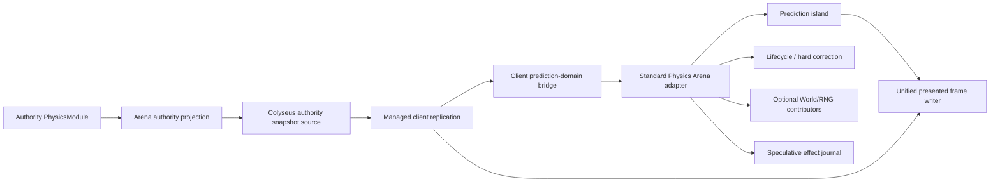

# Multiplayer Physics Arena Prediction

Status: Closed

## 工作流目标

补齐 managed client replication 与 Physics prediction island 之间的标准组合层，并用独立 3D Knockout Arena Demo
证明高互动多人游戏可以通过一套 descriptor 接入完整成员回滚、authority reconciliation、hard correction、效果去重
和诊断，而不在应用中重建 prediction orchestration。

长期决策见：

- `docs/adr/0049-standard-multiplayer-physics-arena-prediction.md`
- `docs/modules/multiplayer.md`
- `docs/modules/physics.md`
- `docs/apps/multiplayer-physics-arena-demo.md`

本工作流不扩展 provider matchmaking，不实现 joint/ragdoll，不在首轮引入自动 island partition，也不替换现有
Multiplayer Demo、Outpost 或低层 prediction API。

## 基线判断

- `createMultiplayerClientReplication(...)` 影响分析为 HIGH：3 个直接调用、4 个模块和 Multiplayer module install 流程
  依赖它。因此新增能力优先进入 Multiplayer GameModule bridge 和 App Host adapter，不把 Physics 逻辑写进该函数。
- `createPhysicsPredictionIsland(...)`、`createStandardMultiplayerPhysicsPredictionDomain(...)` 和
  `createStandardMultiplayerRollbackDomain(...)` 的上游影响为 LOW，适合作为增量组合点。
- 当前 managed prediction 每个 input frame 只发送一次；在真实有损 datagram 或主动丢包模拟下，严格逐 step FIFO 可能
  因缺失 sequence 停住。高互动 arena 需要标准的 bounded redundant input bundle 和 authority de-dup/contiguous inbox，
  不能让每个 app 自建重发窗口。
- 现有 island 已有 body/collider、spawn/patch/despawn、checkpoint、reconcile、hard correction 和 diagnostics，但缺少
  network-facing island identity/revision/definition contract，以及 checkpoint/history/replay work 的完整 byte/work 预算。
- 标准 Physics prediction domain 当前只有测试和 Sandbox 低层 consumer；没有多人 3D 真实应用证明完整 arena 路径。
- Physics Core 目前没有 joint/constraint 公共协议；首个 Demo 使用 kinematic 机关和 dynamic rigid body，不虚报该能力。

## 目标组合



模块依赖保持：

```text
multiplayer-core generic bridge
          ↑
app-host Physics Arena adapter
       ↗               ↖
physics-core        multiplayer-core
          ↑
physics-rapier3d

multiplayer-physics-arena-demo
→ app-host + multiplayer-colyseus + driver-three + physics-rapier3d
```

## 任务拆分

| 任务                                                  | 状态     | 主要产物                                                                                          | 验收重点                                                                        |
| ----------------------------------------------------- | -------- | ------------------------------------------------------------------------------------------------- | ------------------------------------------------------------------------------- |
| P0：长期设计与执行计划                                | Verified | ADR 0049、Architecture、Multiplayer/Physics 模块文档、Demo 设计和本工作流                         | 文档职责清晰；不把阶段状态写入长期模块文档                                      |
| P1：Input delivery 与 client prediction-domain bridge | Verified | 可选 redundant input bundle、authority inbox、Multiplayer GameModule descriptor/factory lifecycle | 默认单帧输入保持兼容；binding/reset/input/snapshot/frame/dispose 顺序有契约测试 |
| P2：Arena frame 与 island 预算                        | Verified | island id/revision/definition envelope、bytes/replay budgets、校验与 diagnostics                  | 非法/缺失成员不能 replay；所有缓存有硬上限                                      |
| P3：App Host 标准 Physics Arena adapter               | Verified | client adapter、authority projection、standard exports                                            | app 只提供 typed mapping/policy/writer；默认 reconcile/hard correction 顺序唯一 |
| P4：Conformance 与 benchmark                          | Verified | memory backend conformance、Rapier 2D/3D integration、arena benchmark/budget                      | generation/revision/gap/overflow/duplicate/cleanup 和 3D replay 性能均可重复    |
| P5：Knockout Arena 可玩纵切                           | Verified | 新 app、Three/Rapier3D、赛道、玩家控制、bots、round lifecycle                                     | 浏览器 authority/prediction 复用同一 input/snapshot contract；纵切可玩          |
| P6：Room-owned authority 与复制                       | Verified | Colyseus Room、headless authority runtime、typed app schema、arena projection                     | 2 client 读取同一 authority world；逐 step ack，不双写 authority lane           |
| P7：完整 arena client prediction                      | Verified | standard adapter 接入、全成员 island、hard correction、presentation writer                        | app 无私有 replay/history/membership loop；动态互动在同一 tick 重演             |
| P8：效果、诊断与网络矩阵                              | Verified | effect journal、UI feedback、network presets、diagnostics summary                                 | replay 不重复效果；高延迟/丢包时有界退化且可解释                                |
| P9：最终验收与关闭                                    | Verified | e2e、soak、全仓门禁、文档收口                                                                     | 真实双浏览器和性能预算通过；长期结论迁移后关闭工作流                            |

## P1：Input delivery 与 client prediction-domain bridge

1. 为 managed prediction 增加 opt-in redundant input bundle：每包包含当前 frame 和有限个未 ack frame；默认单 frame
   encode/send 行为不变。
2. 增加 authority fixed-step inbox，按 peer/binding generation/sequence 去重并每 tick 消费一个连续 step；gap timeout
   使用显式 hold-last 或 neutral policy，ack 只推进到已经模拟的最高连续 sequence。
3. 在 Multiplayer Core bridge 定义 provider-neutral descriptor，不引用 Physics、World、Renderer 或 backend 类型。
4. Descriptor factory 按 authority binding 创建 runtime；binding/session 变化先 dispose/reset 旧 runtime，再接受新
   generation 的 initial snapshot。
5. Bridge 包装现有 client replication callbacks，固定 authority → input → advance → frame 顺序；低层
   `createMultiplayerClientReplication(...)` 保持现有单 state transition 兼容。
6. Domain output 通过稳定 id 的只读 view 暴露给最终 frame writer；不把任意 mutable runtime 塞进 snapshot。
7. 添加 bundle duplicate/reorder/loss/gap、多个 domain id、factory failure、snapshot-before-binding、reset 和 dispose 测试。

完成定义：5% 主动 input loss 下 authority 仍按连续 sequence 模拟且 ack 前进；一个 fake domain 能证明每份已去重
input/snapshot 只消费一次，binding reset 后旧 state 不可见，且现有 Demo/Outpost 未配置 bundle/descriptor 时行为和
diagnostics 不变。

## P2：Arena frame 与 island 预算

1. 定义 network-facing arena frame envelope：`islandId`、generation、tick、membership revision、definition version、
   完整 members；input ack 仍由 app schema 管理。
2. 为 prediction island 增加 max checkpoint bytes、max total history bytes 和 max replay ticks/work 预算；任何溢出返回
   typed result/diagnostic，不在高频路径抛出不可解释异常后继续运行。
3. Authority frame ingress 验证成员 id 唯一、body id/definition 可解析、state number 有限、成员/bytes 受限。
4. revision/generation/definition 改变时执行事务式 hard correction，清空旧 history/command，并只在完整 definition
   可用时提交新 baseline。
5. 增加 state checksum 与 authority/local tick diagnostics；checksum 只做漂移检测，不控制权威玩法。
6. 明确 replay contact 是 speculative observation；只有稳定 contact/effect id 才能提交到 effect journal，不能重复
   发 EventBus/GAS/TCA/Audio 事实。

完成定义：缺 member、未知 definition、future snapshot、history gap、revision jump、byte overflow、replay overflow 和
hard-correction failure 均有确定结果、计数和 cleanup 测试。

## P3：App Host 标准组合

1. 新增 `createStandardMultiplayerPhysicsArenaPrediction(...)`，创建/持有 island、标准 Physics prediction domain、可选
   gameplay rollback contributors 和 effect journal。
2. 新增 authority projection helper，从 authority-owned `PhysicsHandle` checkpoint/snapshot 与显式 membership source
   生成 arena frame；不把 provider serializer 或 app Schema 放进 App Host。
3. Adapter 只接受 shared Data/layout definition resolver，拒绝把 Rapier native handle 放入 member definition。
4. 安装时检查 rollback ownership：同一 body/component 不能同时由 arena island 和通用 Physics contributor 捕获。
5. 暴露低分配 `stateInto`/iterator 或稳定 read view，供 World/Renderer/Camera writer 同帧消费。
6. Standard exports、README、contract test 和 dispose lifecycle 同步完成。

完成定义：测试 app 只实现 snapshot/input/member/writer mapping 即可跑通 predicted input → authority reconcile → replay →
hard correction；测试源码中不存在 app-owned history、binding、revision 或 correction map。

## P4：验证工具

新增 `arena-prediction` benchmark，不把 fixture construction 计入目标区间。建议覆盖：

- 16 members / 128 history ticks / 12-tick rollback 的 steady profile；
- 32 members / 128 history ticks / 30-tick rollback 的 stress profile；
- 64 members 的容量与 hard-correction profile；
- membership churn、snapshot gap、late input、duplicate command 和 dispose retained state；
- Rapier 3D full-scene capture/restore/resimulation 与 checksum drift。

关闭前性能门禁：

- 16-member/12-tick rollback p95 不高于 8 ms，max 不高于 32 ms；
- 32-member/30-tick rollback p95 不高于 25 ms，max 不高于 50 ms；
- 32-member arena frame 的未压缩 payload 不高于 16 KiB；
- 默认 128-tick history 不高于 24 MiB；
- hard correction 在完整 definition 下成功率 100%；
- dispose 后 history、command、binding、effect entry 和 Physics scene retained count 均为 0；
- 10 分钟模拟的最终 retained heap 增长不超过 2 MiB、分钟采样峰值增长不超过 4 MiB，且所有 queue/registry
  保持硬上限。

若首个 Rapier 3D 基线无法满足上述时间预算，先 profile checkpoint copy、scene rebuild 和 replay step；只有证明预算不
合理后才在本工作流记录测量证据并调整，不能通过减少互动成员或关闭 replay 伪造通过。

## P5–P8：Knockout Arena Demo

### 场景与玩法

- 3D 程序化短赛道：起点坡道、旋转 sweeper、拥挤门和可推动球/箱、移动平台、终点。
- 默认 2 human + 6 authority bots；12-player preset 用于 crowd stress。
- 动态 capsule 玩家支持 move/jump/dive；移动机关使用 versioned deterministic kinematic schedule。
- authority 管理 countdown、检查点、掉落重生、qualified/eliminated、排名、results 和 rematch。
- 不引入 joint/ragdoll、外部品牌资产、复杂动画状态机、经济或多地图轮换。

### 实现顺序

1. 从 Physics 3D Lab 和 Three Demo 复用 App Host/Driver/Physics 组合，不复制 native runtime owner。
2. 先完成 local authority + snapshot loop，确保离线与远端共享 gameplay orchestration。
3. 建立 Room-owned headless authority，按 ingress → fixed Physics/gameplay → projection/ack commit 顺序 tick。
4. 先以 authority interpolation 跑通两个客户端，再打开标准 arena descriptor；方便对照同步和 prediction 结果。
5. 固定整个 round 为单 island；respawn/leave/round reset 用 generation + membership revision 安装完整 baseline。
6. 加入 effect journal 和统一 presentation writer；Renderer/camera 不读取 raw authority 或写回 solver state。
7. 最后加入网络 preset、diagnostics、bots stress 和浏览器多窗口 smoke。

### 网络故障矩阵

至少覆盖：

| one-way latency | jitter | input loss | snapshot gap               | 预期                                           |
| --------------- | ------ | ---------- | -------------------------- | ---------------------------------------------- |
| 0 ms            | 0 ms   | 0%         | 0                          | confirmed 为主，无 hard correction             |
| 50 ms           | 20 ms  | 0%         | 0                          | bounded replay，输入 lead 不溢出               |
| 100 ms          | 30 ms  | 2%         | 3 frames                   | 不穿透已知 blocker，不重复 jump/dive effect    |
| 150 ms          | 50 ms  | 5%         | 8 frames                   | history 内恢复；超预算时明确 hard correction   |
| 任意            | 任意   | 任意       | generation/revision change | 丢弃旧 command/history/effect，安装新 baseline |

### Demo 完成定义

- 两个浏览器窗口进入同一 session，看到相同 round、成员、机关、淘汰和结果。
- 本地控制在网络延迟下即时，玩家/玩家、玩家/机关、玩家/动态道具的接触由完整 island 预测并被 authority 校正。
- 已知静态/kinematic blocker 前无持续穿透；membership 不完整时不继续 replay。
- app 的 prediction integration 只包含 descriptor、typed mapper、member policy 和 writer，没有私有 ack/history/replay/
  hard-correction/effect settlement 状态机。
- diagnostics 能从一次 correction 追到 authority frame、generation/revision、replayed ticks、member set 和 effect 结果。
- authority-only 的 qualified/eliminated/ranking 不因 client replay 重复提交。
- 10 分钟 bots soak、双窗口 browser smoke、网络矩阵和 P4 性能门禁通过。

## 测试与验证命令

实现期间按任务运行聚焦测试；关闭前至少运行：

```bash
corepack pnpm test
corepack pnpm build
corepack pnpm lint
corepack pnpm format
corepack pnpm bench:world
corepack pnpm bench:multiplayer:check
corepack pnpm bench:checkpoint:check
corepack pnpm bench:projectile-prediction:check
corepack pnpm bench:arena-prediction:check
```

浏览器验证使用两个真实窗口和同一 Colyseus session，检查首屏、输入 scope、完整一局、rematch、network presets、
diagnostics 和 console error。Headless integration 必须使用真实 Rapier 3D adapter，不只用 memory backend。

## 2026-08-11 可验收纵切证据

- Multiplayer Core 的 authority host loop 已直接消费显式 `redundant-bundle` delivery；app 不拆包、不维护 resend window、
  duplicate set、gap counter 或 ack history。默认单帧分支保持原行为。Core 聚焦回归为 10 files / 81 tests passed，包含
  hold-last gap frame 使用 bundle sequence 而不是旧 payload sequence 的回归。
- Physics island 已有 checkpoint bytes、total history bytes 和 per-operation replay tick 预算；App Host Arena adapter 已覆盖
  baseline install、input command mapping、revision rebuild、replay-budget hard correction、authority payload budget 和 dispose。
- 新增 `apps/multiplayer-physics-arena-demo`：Room-owned Colyseus authority 以 60 Hz 推进 Rapier3D，20 Hz 发布完整 14-member
  arena frame；默认成员为 2 个真人 slot、6 个 authority bots、3 个动态道具和 3 个 kinematic 机关。
- Headless Room 集成测试使用两个真实 Colyseus client，确认双方映射到 `player.0/player.1`、读取同一完整 island，并把冗余
  input bundle 连续消费到 ack `2/1`；authority 报告 3 accepted、0 rejected，frame payload 大于 1 KiB 且低于预算。
- 双浏览器 smoke 确认 Create/Join 同一 session、倒计时/运行/结果阶段、Three WebGL 表现、键盘 move/jump、全岛
  reconcile/resimulation 和 telemetry。观测样本包含 `resimulatedTicks=81`、`replayBudgetOverflows=0`；两个页面无 runtime
  error，仅有 Rapier compat 上游初始化 API 的 deprecation warning。
- `arena-prediction` 使用真实 Rapier3D、排除 fixture construction，24 轮测得 16-member/12-tick rollback
  `p95=3.936 ms / max=9.145 ms`，32-member/30-tick rollback `p95=11.241 ms / max=13.958 ms`；对应 payload 为
  `6.05/12.01 KiB`，history 为 `2.83/5.38 MiB`。64-member capacity/hard-correction profile payload `22.69 KiB`，
  25 项预算全部通过，所有 profile 的 hard-correction failure、replay overflow 和 dispose retained state 均为 0。
- Multiplayer Core 新增可包裹任意 backend 的确定性 network-condition simulator。Arena 四档矩阵覆盖 0 ms、
  50±20 ms、100±30 ms + 2% loss、150±50 ms + 5% loss + 2% duplicate；分别观察 authority consumed sequence 与
  client observed ack，并在 120 recovery tick 后验证 ack lag、ordered sequence、duplicate、capacity 和 delivery error。
- Jump 以 `member + input sequence`、contact 以 collider pair/kind/predicted tick 建立稳定 effect identity；authority ACK 和
  snapshot contact cue 分别执行 confirm，round generation reset、超龄与 dispose 执行 cancel。重复 replay 只产生一次
  UI anticipation/confirmation，2 个 effect contract tests 覆盖 duplicate、confirm、reset 和 expire。
- `arena-prediction-stability` 使用真实 Rapier3D 运行 10 分钟虚拟时长：14 members、60 Hz、20 Hz authority、3-tick
  delay，共 36,000 tick 和 36,597 resimulated tick；history 固定 181 entries / 4.421 MiB、commands 2,520、峰值 retained
  heap 增长 0.356 MiB，queue/reconcile/replay/hard-correction failure 均为 0，dispose retained state 为 0。
- 最终全仓门禁为 test 92/92 tasks、build 50/50 tasks、lint 92/92 tasks、format check 与 `bench:world` 通过；
  Multiplayer、Checkpoint、Projectile Prediction、Arena Prediction 共 69 项 benchmark budget 全部通过。
- 最终双浏览器验收中两个独立页面分别绑定 `player.0/player.1`，同一采样 authority tick 为 1509、active peers 为 2、
  rejected input 为 0；双方均产生有界全岛 resimulation，键盘 jump 与 contact UI feedback 完成 anticipate → confirm，
  replay budget overflow 为 0。两个 Three/WebGL 视图显示同一赛道/机关/成员状态；控制台无 runtime error，仅保留 Rapier
  compat 上游 initialization deprecation warning。

## Review 与关闭规则

- 每个 P 任务独立实现、review、测试和提交；记录 GitNexus impact、受影响流程、验证结果和 commit。
- 修改任何公共 symbol 前按 AGENTS.md 运行 upstream impact；HIGH/CRITICAL 风险先报告并补回归矩阵。
- 提交前运行 GitNexus detect changes，确认没有把 Physics 类型泄漏进 Multiplayer Core 或把 app 玩法下沉进包。
- 工作流关闭时，把已验证的长期结论迁移到 Architecture、Multiplayer、Physics、Best Practices 和 Demo 设计；记录最终
  命令、性能数据、commit/PR，然后将状态改为 Closed。
